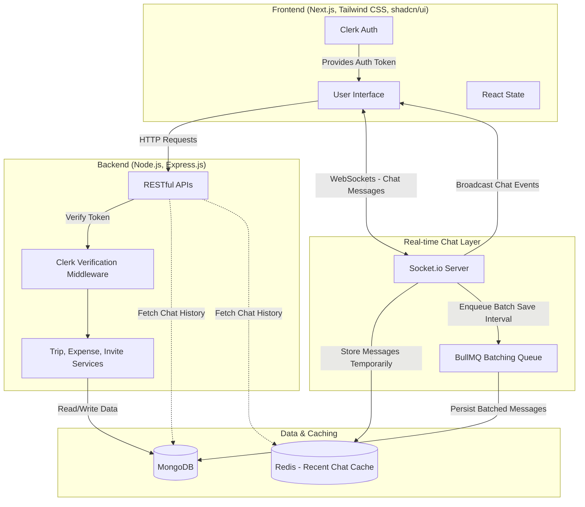

# 🌍 TripSync

TripSync is a full-stack collaborative travel platform enabling users to create trips, manage itineraries, track expenses, and coordinate with team members in real time.

Plan your itinerary, chat together, and document your journey — all in one place.

---

## ✨ Features

- 📝 **Trip Planning** – Create trips and manage shared itineraries with multi-user editing.
- 💰 **Expense Tracking** – Track expenses and split costs seamlessly across the group.
- 👥 **Real-time Collaboration** – Experience group chat, shared itinerary editing, and synchronized multi-user interactions via Socket.io.
- 🔐 **Secure Authentication** – Secure login using Clerk OAuth (Google Sign-In), protected routes, and role-based access control for collaborators.
- ✅ **Task Management** – Create tasks, set priorities, and assign them to team members.
- 📊 **User Dashboard** – Personalized dashboard to track trips, stories, and activities.
- ⚡ **Scalable Architecture** – Uses Redis and BullMQ for caching, asynchronous job processing, background workflows, and reliable message persistence.

---

## 🛠️ Tech Stack

- **Frontend:** Next.js, TypeScript, Tailwind CSS, shadcn/ui
- **Backend:** Node.js, Express.js, MongoDB
- **Real-time Communication:** Socket.io
- **Authentication:** Clerk OAuth
- **Background Jobs & Caching:** Redis, BullMQ
- **Deployment & Version Control:** Vercel, Git & GitHub

---

## 🏗️ Project Architecture



---

## 📦 Getting Started

Follow these steps to run TripSync locally:

### 1. Clone the repo
```bash
git clone https://github.com/raghukartik/TripSync.git
cd TripSync
```

### 2. Install dependencies
```bash
# Install backend dependencies
cd backend
npm install

# Install frontend dependencies
cd ../frontend
npm install
```

### 3. Setup environment variables
Create a `.env` file in the `backend` folder and add the following variables:
```env
# Authentication & Security
ACCESS_TOKEN_SECRET=your_jwt_secret
SESSION_SECRET=your_session_secret
OAuth_Client_ID=your_google_oauth_client_id
OAuth_Client_Secret=your_google_oauth_client_secret

# Clerk Authentication
CLERK_PUBLISHABLE_KEY=your_clerk_publishable_key
CLERK_SECRET_KEY=your_clerk_secret_key

# Database
MONGO_URI=your_mongodb_connection_string

# Upstash Redis (TCP URL from Upstash dashboard — used for cache, BullMQ, and sockets)
UPSTASH_REDIS_URL=your_upstash_redis_tcp_url
# Optional alias:
# REDIS_URL=your_upstash_redis_tcp_url

# Email Services
EMAIL_USER=your_email_address
EMAIL_APP_PASSWORD=your_email_app_password

# Client URLs & Domain
FRONTEND_URL=http://localhost:3000
DEPLOYED_FRONTEND_URL=your_deployed_frontend_url
COOKIE_DOMAIN=.yourdomain.com

# Environment
NODE_ENV=development
```

Create a `.env.local` file in the `frontend` folder and add your Clerk public keys and NEXT_PUBLIC environment variables.

### 4. Run the backend server
```bash
cd backend
npm run dev
# Backend runs on http://localhost:8000
```

### 5. Run the frontend server
```bash
cd frontend
npm run dev
# Frontend runs on http://localhost:3000
```

---

## 🤝 Contributing

Contributions, issues, and feature requests are welcome!  
Feel free to open a pull request or start a discussion in the [issues](https://github.com/raghukartik/TripSync/issues).

---

## 👤 Author

- **Kartik Raghuwanshi**  
  💼 [LinkedIn](https://www.linkedin.com/in/kartik-raghuwanshi-5a2b83267/)  
  🐙 [GitHub](https://github.com/raghukartik)  
